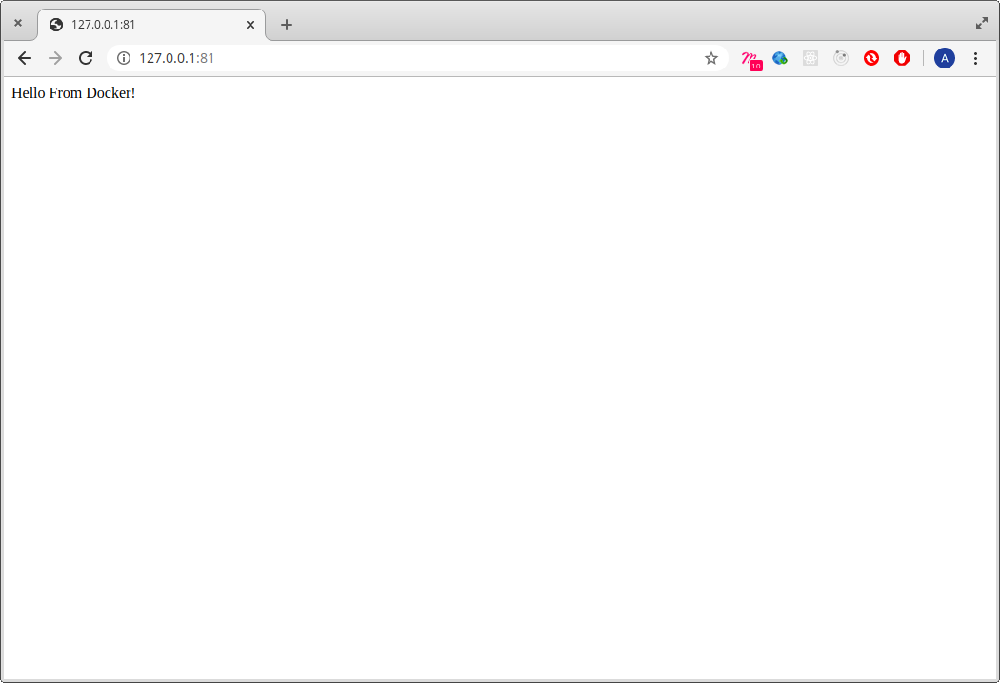

In the [previous post](/read/beginning-dev-ops-day-5), I was trying to get ansible to work and spoilt my machine, lmao.

## Today

I actually didn't do any study today tbh. I took today off to rest and read another book, "Black Swan". However, I deployed a node app with docker.

Docker seems to be the most friendly tool to me tbh, I so much love it haha! Well, this post will be a recap:

## This week

I started this journey after taking my time to decide what I want, the console has been cool. I mean, it's sweeeeeeeeeeeeeeeeeeeeeeeeeeeeeeeet, I reached out on Twitter, and got resources and I have two go to mentors who are always available to answer my questoins - Bakare & Obinna. I also have a current reader, Etin!

* I learned what DevOps is, and it's constituents - CI, CD, Automation, Containerization, Cloud Computing etc.
* I learned about AWS & the services provided. I also created an instance, bucket and a volume.
* I learned about roles, permissions and policies in AWS in the IAM section.
* I learned how to use Jenkins, a really stressful CI tool tbh.
* I learned what Ansible is and successfully destroyed my machine with it.. I mean, `sudo`.
* I learned patience. I can't learn anything without patience and DevOps requires patience and practice.

---

I had one of the best weeks in 2020 tbh. I mean, it was fun all through, and I'm pretty sure there's more fun ahead. I have also learned that there are more tools, and it depends on which works for you and/or gets the job done easily.

Although, there are preferences based on popularity, flexibility etc. Choose, and understand that which works for you.

I still have a lot to learn and today was basically about Docker. 